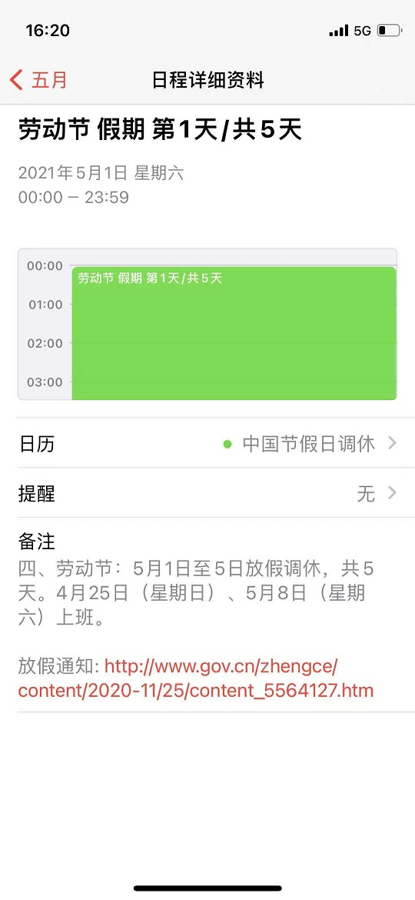
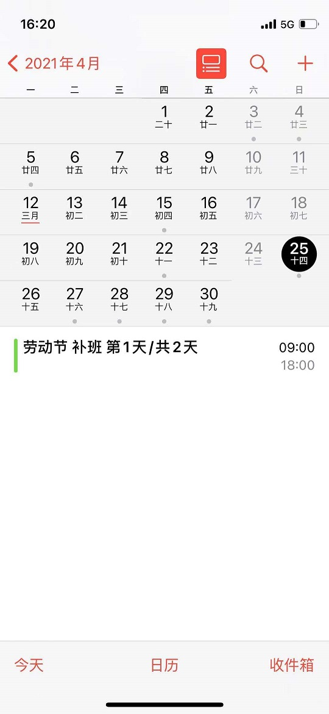
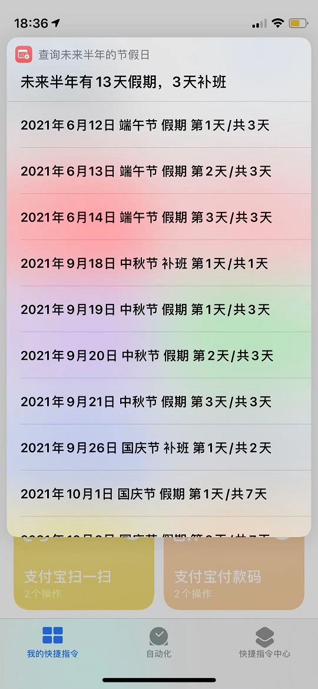

## 中国节假日补班日历

### 订阅地址
- 2019~2021年中国节假日信息: [https://raw.githubusercontent.com/lanceliao/china-holiday-calender/master/holidayCal.ics](https://raw.githubusercontent.com/lanceliao/china-holiday-calender/master/holidayCal.ics)

### 特点
1. 节假日信息来自[中国政府网](http://www.gov.cn/)，一手信息、权威准确
2. 包含最近3年的节假日信息，机器人自动维护，更新及时
3. 日历标题包含放假、补班的天数信息
4. 日历标题包含放假、补班等关键字，方便脚本开发。例如使用`iPhone`的`快捷指令`应用编写工作日闹钟
5. 每个补班日期自动设置上班提醒，时间为早上`08:00`

### 放假日程

日程表            |  详细信息
:-------------------------:|:-------------------------:
  |  

### 补班日程

日程表            |  详细信息
:-------------------------:|:-------------------------:
  |  

### 快捷指令应用

节假日查询            |  节假日闹钟
:-------------------------:|:-------------------------:
  |  
