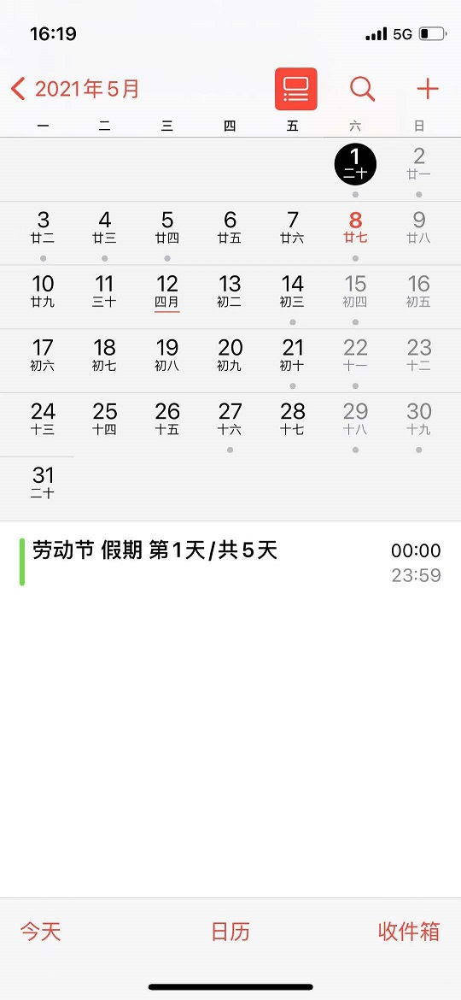
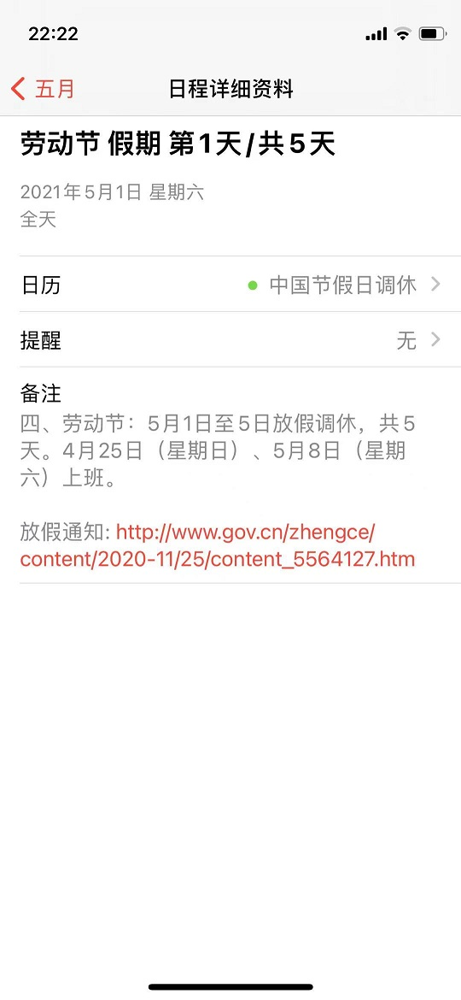

# 中国节假日补班日历

## 说明
2022~2024年中国放假、调休和补班日历 更新时间2023-11-05 00:42:55

### 支持3种类型的日历
- `holidayCal.ics` 包含放假和调休
- `holidayCal-HO.ics` 仅包含放假
- `holidayCal-CO.ics` 仅包含调休

### 订阅地址
*注：链接地址为完整日历，若仅需放假或调休日历，替换URL的日历名称即可*
- 国内订阅地址(**支持定制补班日程**): [https://www.shuyz.com/githubfiles/china-holiday-calender/master/holidayCal.ics](https://www.shuyz.com/githubfiles/china-holiday-calender/master/holidayCal.ics)
- jsDelivr订阅地址: [https://cdn.jsdelivr.net/gh/lanceliao/china-holiday-calender/holidayCal.ics](https://cdn.jsdelivr.net/gh/lanceliao/china-holiday-calender/holidayCal.ics)
- GitHub订阅地址(科学上网): [https://raw.githubusercontent.com/lanceliao/china-holiday-calender/master/holidayCal.ics](https://raw.githubusercontent.com/lanceliao/china-holiday-calender/master/holidayCal.ics)

## 特点
1. 节假日信息来自[中国政府网](http://www.gov.cn/)，一手信息、权威准确
2. 包含最近3年的节假日信息，机器人自动维护，更新及时
3. 日历标题包含放假、补班的天数信息
4. 日历标题包含放假、补班等关键字，方便脚本开发。例如使用`iPhone`的`快捷指令`应用编写工作日闹钟
5. 每个补班日程自动设置上班提醒，默认时间为`09:00~18:00`、提前一个小时提醒
6. 支持个性化定制补班日程的开始、结束时间和提醒时间(例如提前一天提醒)
7. 没有广告！！！

## 放假日程

日程表            |  详细信息
:-------------------------:|:-------------------------:
  |  

## 补班日程

日程表            |  详细信息
:-------------------------:|:-------------------------:
  |  

## 定制补班日程

支持指定补班日程的开始、结束时间和提醒时间，格式为：`订阅地址`?token=`API密钥`&compStart=`上班时分秒`&compEnd=`下班时分秒`&compAlarm=`在开始时间点提前多少分钟提醒`

例如补班时间为早上8.30到晚上8.30，提前15分钟提醒，则订阅地址为 `https://www.shuyz.com/githubfiles/china-holiday-calender/master/holidayCal.ics?token=cb429c2a-81a6-4c26-8f35-4f4bf0c84b2c&compStart=083000&compEnd=203000&compAlarm=15`

**注意:**
- 时间格式为24小时制的6位数字，个位补0，例如`8点零5分`表示为`080500`
- 最大可提前9999分钟提醒，所以提前几天也是可以的。例如`compStart`为`0800`，设定前一天早上8点提醒，则`compAlarm`为`提前24小时x60=1440`; 设定前一天晚上8点提醒，则`compAlarm`为`提前12小时x60=720`
- 补班日程可设置为全天事件，指定`compStart=*`并且`compEnd=*`即可
- 由于订阅功能需消耗服务器资源进行计算，如果影响到服务器的正常使用，则定制功能可能随时取消

定制补班日程表            |  详细信息
:-------------------------:|:-------------------------:
  |  

## 快捷指令应用

节假日查询            |  节假日闹钟
:-------------------------:|:-------------------------:
  |  
[https://www.shuyz.com/shortcuts/holiday-query](https://www.shuyz.com/shortcuts/holiday-query) | [https://www.shuyz.com/shortcuts/holiday-alarm](https://www.shuyz.com/shortcuts/holiday-alarm)

